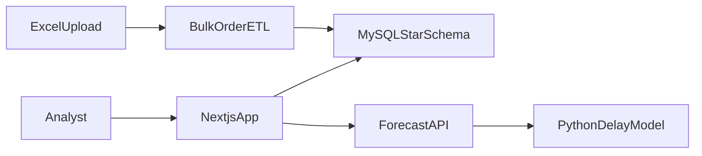

# Nexus Logistics

Nexus Logistics is an enterprise business-intelligence app for retail fulfillment. It turns a warehouse of order facts into two decision views — commercial performance and delivery quality — and scores new shipments for delay risk before they leave.

The product exists so sales growth and operations stay on the same numbers. A region can look profitable while late deliveries and returns are already eroding that result. This app is built so both questions are answered from one star schema:

- Are sales and profit growing in the right regions and categories?
- Can delivery speed, on-time performance, and returns sustain that growth, and which new shipments are likely to be late?

## What we are shipping

A signed-in web app over a MySQL warehouse. Analysts filter the same order history, load new orders, and score a proposed shipment without leaving the product.

### Sales Insights (`/dashboard`)

The commercial view: total sales, profit, and orders, with return rate and on-time delivery kept in view so revenue is not read in isolation. It also shows sales trends, regional performance (sales, profit, late rate), delivery by category, and ship-mode mix. Shared filters — region, state, year, and month — carry over when you open Operations Insights.

### Operations Insights (`/analytics`)

The execution view: average delivery time, return rate, and on-time versus late delivery. It ranks categories by profit, breaks sales, profit, and returns down by customer segment, shows late delivery by ship mode, and surfaces products and categories with high return rates (with a minimum order count so tiny samples do not dominate).

### Delay-risk forecast (`/forecast`)

A form for a proposed shipment. The app returns a calibrated probability (`delayRiskScore`) and a label:

- **Low** below 0.3
- **Medium** from 0.3 up to 0.6
- **High** at 0.6 and above

Inference runs through `POST /api/forecast/predict`, which calls `scripts/forecast_predict.py` against a saved scikit-learn classifier. Training, calibration, and evaluation live in `notebooks/delay_forecast_training.ipynb`. The documented holdout used a calibrated `HistGradientBoostingClassifier`: ROC-AUC 0.917, macro-F1 0.825, accuracy 0.828, Brier score 0.114. Those figures describe that training run.

### Order intake

Orders can be entered by hand, searched, or loaded from Excel. The bulk path (`POST /api/orders/bulk`) is a small ETL: the browser reads the first sheet, the server validates and normalizes each row (dates, enums, derived profit and transit days), rejects duplicate keys and unknown dimension references, and inserts the batch into `fact_retailorder` in a single transaction. A failed row fails the whole batch.

### Catalog and shipping

Products can be searched and added. Shipments shows ship-mode volume and performance as charts so mode choice is visible next to the delay and sales views.

### Data foundation

Both dashboards read one warehouse-style star schema:

- **Fact:** `fact_retailorder`
- **Dimensions:** `dim_location`, `dim_customer`, `dim_customersegment`, `dim_product`, `dim_subcategory`, `dim_category`, `dim_shipmode`, `dim_retailsalespeople`

Analytics routes under `src/app/api/analytics/*` join the fact to those dimensions and apply the same filter definitions, so Sales and Operations stay consistent.



## Current scope

Help and Settings are navigation placeholders. Sign-in is credentials-based and still wired for development. The shipped product is the two insight dashboards, the delay-risk forecast, order intake, and the product and shipment screens on top of the warehouse.

## Stack

Next.js 16 (App Router) and React 19 in TypeScript, styled with Tailwind CSS 4. The API routes talk to MySQL through `mysql2`. Auth uses NextAuth. Motion uses Framer Motion. Excel uploads use the `xlsx` parser. Delay scoring is a Python process spawned from the forecast API, so the UI and the trained model stay in one repo.

## Run locally

```bash
npm install
npm run dev
```

Open [http://localhost:3000](http://localhost:3000).

Live dashboards need a reachable MySQL warehouse (`DB_HOST`, `DB_PORT`, `DB_USER`, `DB_PASSWORD`, `DB_NAME`) and the `ca.pem` certificate the pool loads from the project root. Real delay scores need the model files the forecast script expects by default:

- `models/forecast/delay_classifier.pkl`
- `models/forecast/forecast_metadata.pkl`

## Further reading

- [Dashboard design](./DASHBOARD_INSIGHTS.md) — why Sales and Operations are split, and how each chart maps to the warehouse
- [Delay forecast pipeline](./delay-forecast-system.md) — training, calibration, thresholds, and the inference contract
- [Bulk order ETL](./ETL_PIPELINE.md) — extract, validate, and load for Excel uploads
- [API creation guide](./API_CREATION_GUIDE.md) — how new App Router endpoints are added
